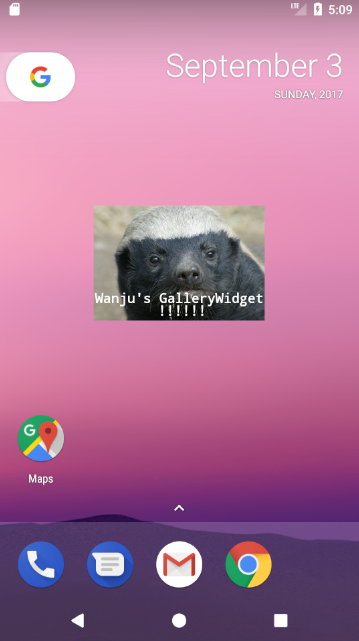
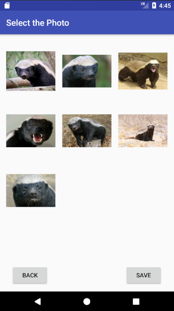
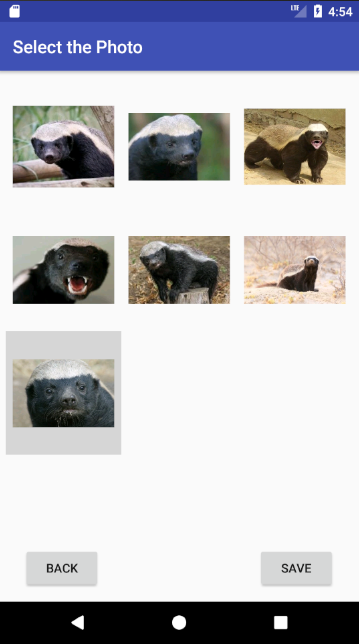
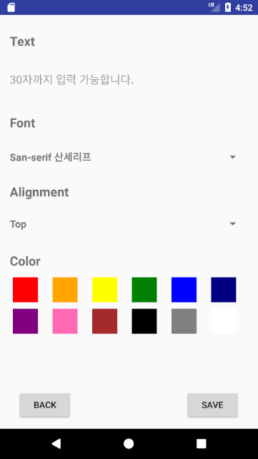
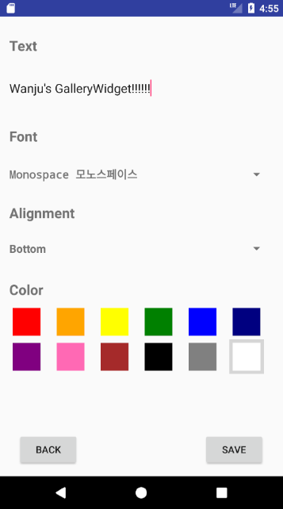

# Android GalleryWidget

This is an application which helps users able to make their own widget. 

They can put a photo and a text together in one widget. 

It enables to edit the text with various kinds of fonts,alignments and colors.

## Necessity

I used to crave putting a picture on homescreen, but not as background picture. 

What I wanted is easy to be made and deleted and an app widget is just appropriate for it. 

I had started making Gallery Widget, though, this kind of widget already exists as one of default widgets in Galaxy. 

However, you can write text and customize features which is very distinguishable from the previous one. 

## Challenges & Solutions

### 1. Dealing with Multiple App widgets 
* updating Widget using individual update method
* explicitly sending intent with Widget ID
<pre><code>public void individualUpdate(Context context,AppWidgetManager appWidgetManager,int appWidgetId){
        Intent intent=new Intent(context,ConfigWidgetActivity.class).addFlags(Intent.FLAG_ACTIVITY_SINGLE_TOP);
        intent.putExtra(AppWidgetManager.EXTRA_APPWIDGET_ID,appWidgetId); // manually sending appWidgetId to update the data
        PendingIntent pendingIntent=PendingIntent.getActivity(context,appWidgetId,intent,PendingIntent.FLAG_UPDATE_CURRENT);

        RemoteViews updateViews=new RemoteViews(context.getPackageName(),R.layout.widget_layout);
        updateViews.setOnClickPendingIntent(R.id.mLayout,pendingIntent);

        // setting remoteview ...

        appWidgetManager.updateAppWidget(appWidgetId,updateViews); // real update here

    }
</code></pre>
### 2. Saving Settings 
* using SharedPreference with key (Widget ID)
<pre><code>SharedPreferences setting=getSharedPreferences(String.valueOf(appWidgetId),0);
SharedPreferences.Editor editor=setting.edit();

editor.remove(PHOTO);
editor.putString(PHOTO,path);
editor.commit();
</code></pre>

### 3. Customizing Text 
* changing TextView into ImageView using Bitmap and Paint
<pre><code>public Bitmap setText(AppWidgetManager appWidgetManager,Context context, Bitmap photo, String text, int font, int align, int color){
        Bitmap textImage=Bitmap.createBitmap(photo.getWidth(),photo.getHeight(),Bitmap.Config.ARGB_8888);
        Canvas canvas=new Canvas(textImage);
        Paint paint=new Paint();
        
        // set text features ...
        
        /* Draw text image in the right location */

        condition=true;
        start=0;
        textLength=0;

        while(condition){
            paint.getTextBounds(text,0,0,sampleBounds);

            while(sampleBounds.width()<photo.getWidth()){ //
                textLength++;
                paint.getTextBounds(text,start,textLength,sampleBounds);
                if(textLength>=text.length()){
                    condition=false;
                    break;
                }
            }
            if(textLength!=text.length())
                textLength--; // it finishes when text width is longer than photo width

            paint.getTextBounds(text,start,textLength,sampleBounds);

            x=(photo.getWidth()-sampleBounds.width())/2;
            canvas.drawText(text.substring(start,textLength),x,y,paint);
            y-=paint.descent()+paint.ascent()-10; // sentences have been overlapped without subtracting 10

            start=textLength;
        }
        
        return textImage;
    }
</code></pre>

## Functions

### 1. Choose a photo
* scanning gallery using RecyclerView and Glide library

### 2. Edit text
* editing text using EditText, Spinner and RecyclerView

